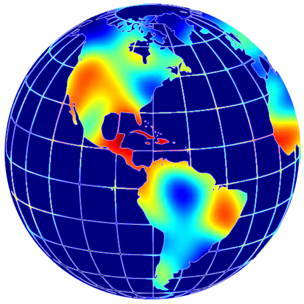

<h1 align="center">
  <a href="https://github.com/girkovarpa/genetic-origins-heatmap">
    
  </a>
  <br>
  <br>
  Genetic Origins Heatmap
  <br>
  <br>
</h1>

<h3 align="center">
  Use your 23andMe or AncestryDNA data to paint a heatmap of your origins.
</h3>

<h1 align="center">
  </a>
  <br>
  <br>
</h1>

<h3>Build command:</h3>

```bash
pyinstaller main.py --clean --name heatmap --onefile -i"icon.ico" --paths "admix" --add-data "admix/data/K36.alleles;./data" --add-data "admix/data/K36.36.F;./data" --add-data "sciter/main.html;./sciter" --add-data="sciter/about.html;./sciter" --add-data="sciter/favicon.png;./sciter" --add-data="sciter/loading.png;./sciter" --add-data="sciter/sciter.png;./sciter" --add-data="sciter/simpleheat/heatmap.js;./sciter/simpleheat" --add-data="sciter/taux-de-similitude/index.js;./sciter/taux-de-similitude" --add-data="sciter/taux-de-similitude/fn.js;./sciter/taux-de-similitude" --add-data="sciter/taux-de-similitude/data.js;./sciter/taux-de-similitude" --add-data="sciter/taux-de-similitude/cells.js;./sciter/taux-de-similitude" --add-data="sciter/taux-de-similitude/america.png;./sciter" --add-data="sciter/taux-de-similitude/europe.png;./sciter" --add-data="sciter/taux-de-similitude/asia.png;./sciter" --add-data="sciter/128x128.png;./sciter" --windowed
```

<h3>Dependencies:</h3>

- [sciter.dll](https://github.com/c-smile/sciter-js-sdk/blob/main/bin/windows/x64/sciter.dll)
- [K36.36.F](https://github.com/stevenliuyi/admix/blob/master/admix/data/K36.36.F)
- [K36.alleles](https://github.com/stevenliuyi/admix/blob/master/admix/data/K36.alleles)

<h3>
  Based on:
</h3>

- [Admix](https://github.com/stevenliuyi/admix)
- [Taux de Similitude](https://gen3553.pagesperso-orange.fr/ADN/similitude.htm)
