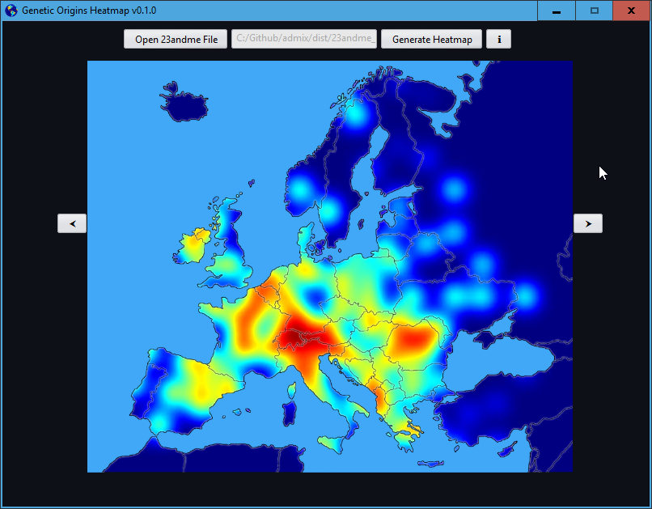

<h1 align="center">
  
   
   
  Genetic Origins Heatmap
   
   
</h1>

<h3 align="center">
  Use your 23andMe data to paint a heatmap of your origins.
</h3>

<h1 align="center">
  </a>
   
   
</h1>

<h3>
  Based on:
</h3>

- [Admix](https://github.com/stevenliuyi/admix)
- [Taux de Similitude](https://gen3553.pagesperso-orange.fr/ADN/similitude.htm)
